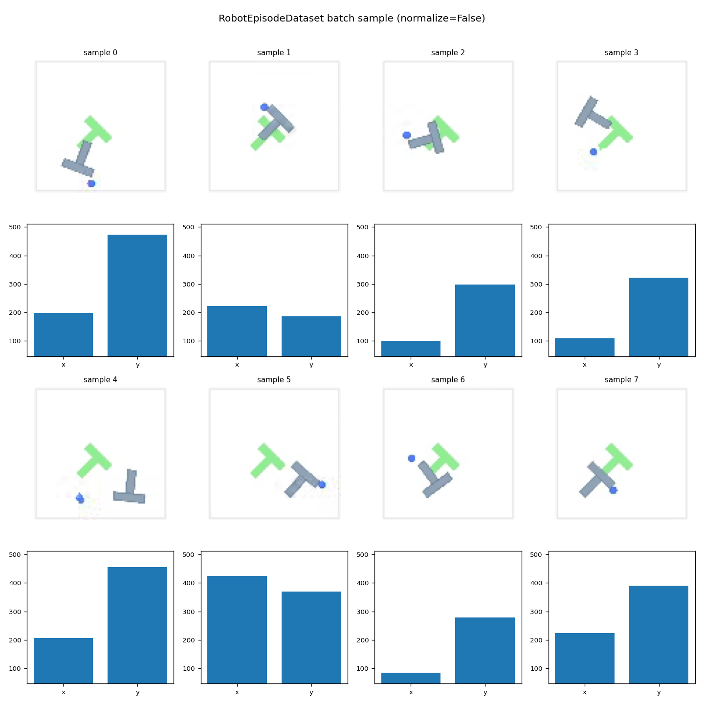

# Month 1 — robot-data-forge
### A Robot Learning Data Engine over Open-X / LeRobot

Ingests raw robot demonstration episodes from the [LeRobot](https://github.com/huggingface/lerobot) 
dataset library, profiles the dataset structure, and renders annotated MP4 visualizations 
with per-frame action overlays.

**Dataset:** `lerobot/pusht` — 206 episodes, 25,650 frames, 2D end-effector control

---

## Output

[](outputs/episode_000.mp4)

*Episode 0 rendered at 384×384 (4× upscaled from 96×96 source). 
Action overlays show [x, y] target position per frame.*

---

## Dataset Profile

| Metric | Value |
|---|---|
| Total episodes | 206 |
| Total frames | 25,650 |
| FPS | 10 |
| Episode length (mean) | 124.5 frames |
| Episode length (min / max) | 49 / 246 frames |
| Action dim | 2 (x, y target position) |
| Image shape | 3 × 96 × 96 (C, H, W) |
| Image dtype | float32 \[0.0, 1.0\] |
| Success rate | 0% (demonstrator data — no sparse reward signal) |


---
## How to Run

```bash
# 1. Environment (Python 3.11, MPS backend for M4 Mac)
python -m venv ~/envs/robotics && source ~/envs/robotics/bin/activate
pip install torch lerobot opencv-python matplotlib

# 2. Render an episode
python visualize_episode.py --episode 0

# 3. Profile the dataset
python profile_dataset.py

# 4. Smoke-test episode extraction across index range
python scripts/check_episodes.py
```

Override output directory without touching code:
```bash
OUTPUTS_DIR=/tmp/renders python visualize_episode.py --episode 5
```

---

## File Map

| File | What it does |
|---|---|
| `config.py` | Central path config — all scripts read paths from here |
| `extract_episode.py` | Extracts one episode as `{images: (T,C,H,W), actions: (T,2)}` tensors |
| `visualize_episode.py` | Renders episode as MP4 with per-frame action overlays |
| `profile_dataset.py` | Computes dataset statistics and saves JSON + histogram |
| `scripts/check_episodes.py` | Smoke-tests episode extraction across multiple indices |
| `tests/test_extract.py` | Pytest suite for `extract_episode` |
| `dataset_profile.json` | Saved dataset profile (committed as a dataset artifact) |

---

## Architecture Note

All tensor operations stay in PyTorch until the OpenCV boundary.  
`tensor_to_bgr_frame()` in `visualize_episode.py` is the single conversion point:  
`(C,H,W) float32 tensor → (H,W,3) uint8 BGR numpy array`.  
No numpy until OpenCV needs it.

**Background:** The `lerobot/pusht` task is a 2D manipulation benchmark where a robot 
end-effector must push a T-shaped block into a goal zone. The 2D action space makes it 
a clean starting point for understanding the data structure before moving to 6-DOF arm tasks.


## Ingestion Benchmarks

| Metric | Value |
|---|---|
| Episodes ingested | 206 / 206 |
| Total disk usage | 56 MB |
| Avg ingestion rate | 23.6 ep/s (data cached locally) |
| Total wall time | 7.9s |
| Compression | gzip level 4 |
| Chunk shape (images) | (1, 96, 96, 3) — one chunk = one frame |
| Chunk shape (actions) | (1, 2) |
| Failed episodes | 0 |
| Idempotency | ✅ skip-if-done via .done sentinel attribute |

## Pipeline Architecture

```
LeRobot Dataset (HuggingFace)
        │
        │  lerobot/pusht · 206 episodes · 25,650 frames
        ▼
┌─────────────────┐
│   ingest.py     │  extract → normalize → write HDF5
└────────┬────────┘
         │  ep_000000.hdf5 … ep_000205.hdf5
         │  /observations/images  (T, H, W, C) uint8
         │  /observations/state   (T, 2)        float32
         │  /actions              (T, 2)        float32
         ▼
┌─────────────────┐
│   validate.py   │  shape · dtype · NaN · monotonicity checks
└────────┬────────┘
         │  validation_report.json
         ▼
┌─────────────────┐
│ build_index.py  │  scan HDF5 attrs → build episode index
└────────┬────────┘
         │  metadata.parquet
         │  episode_id · frame_count · success · file_path
         ▼
┌─────────────────┐
│   query.py      │  filter by task / success / frame count
└────────┬────────┘
         │
         ▼
    episode IDs  →  downstream DataLoader (Week 3)
```
## File Index

| File | Role |
|---|---|
| `ingest.py` | ETL loop — LeRobot episodes → HDF5 files |
| `validate.py` | Data quality checks on every HDF5 file |
| `build_index.py` | Scans HDF5 attrs → writes `metadata.parquet` |
| `query.py` | Filters episode index, benchmarks query time |
| `write_one_episode.py` | Single-episode write pattern (used in dev/testing) |
| `config.py` | Central path config — all paths live here |
| `run_pipeline.sh` | One-command pipeline runner |

## PyTorch Dataset & DataLoader

`RobotEpisodeDataset` is a flat-indexed `Dataset` over the per-episode HDF5
files, addressed via `outputs/metadata.parquet`. Each item returns:

- `image`: `(C, H, W)` float32 in `[0, 1]` — or `(K, H, W, C)` if `context_window > 1`
- `action`: `(2,)` float32 — pusht's 2D end-effector target position
- `state`: `(2,)` float32 — placeholder (pusht has no proprioceptive state)

```python
from torch.utils.data import DataLoader
from robot_dataset import RobotEpisodeDataset
from config import OUTPUTS_DIR

# normalize=True applies z-score normalization to action/state using
# stats from outputs/dataset_stats.json (compute_stats.py)
dataset = RobotEpisodeDataset(OUTPUTS_DIR / "metadata.parquet", normalize=True)

loader = DataLoader(
    dataset,
    batch_size=64,
    num_workers=8,             # see benchmark table below
    persistent_workers=True,
    shuffle=True,
)

batch = next(iter(loader))
print(batch["image"].shape)   # torch.Size([64, 3, 96, 96])
print(batch["action"].shape)  # torch.Size([64, 2])

# Temporal context window — returns (K, H, W, C), frame-0 padded at
# episode boundaries
ctx_dataset = RobotEpisodeDataset(
    OUTPUTS_DIR / "metadata.parquet", normalize=False, context_window=3
)
print(ctx_dataset[0]["image"].shape)  # torch.Size([3, 96, 96, 3])
```

### DataLoader benchmark (25,650 samples, normalize=True)

| num_workers | pin_memory | batch_size | samples/sec | p95 batch (ms) |
|-------------|------------|------------|-------------|----------------|
| 0 | False | 16 | 5,307 | 3.0 |
| 0 | False | 64 | 5,375 | 11.9 |
| 2 | False | 64 | 9,402 | 6.8 |
| 4 | False | 64 | 15,931 | 4.0 |
| **8** | **True** | **64** | **25,905** | **2.5** |

`pin_memory` is a measured no-op on M4 unified memory (<1% difference).
Bottleneck is HDF5 read + gzip decompression in worker subprocesses
(93.7% of profiled CPU time, per `profile_dataloader.py`). At 56MB the
dataset fits in the macOS page cache after the first pass — these numbers
reflect RAM reads, not NVMe; expect this curve to flatten well before
10,000 episodes.

### Batch visualization



8 samples from the DataLoader (`normalize=False`), each with its raw
`(x, y)` action vector plotted as a bar chart below.
