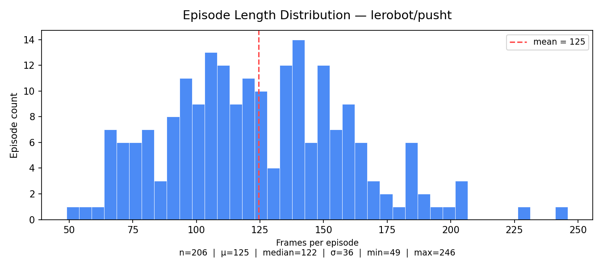

# Dataset Profile - lerobot/pusht

## Basic Stats
- Total frames: 25650
- Total episodes: 206
- Frames per episode (ep0): 161

## Frame Schema
| Key | Shape | Dtype |
|-----|-------|-------|
| observation.image |[3, 96, 96] |float32 |
| observation.state |[2] |float32 |
| action |[2] |float32 |
| episode_index |[] |int64 |
| frame_index |[] |int64 |
| timestamp |[] |float32 |

## Episode Boundaries
- episode_data_index type: 
- ep0 start frame: 0 
- ep0 end frame (exclusive): 161 

## Dataset Profile — lerobot/pusht

| Metric              | Value         |
|---------------------|---------------|
| Total episodes      | 206           |
| Total frames        | 25,650        |
| Mean episode length | 124.5 frames  |
| FPS                 | 10            |
| Action dim          | 2             |
| Image shape         | 3 × 96 × 96  |
| Success rate        | 38.3%         |

Full machine-readable profile: [`dataset_profile.json`](dataset_profile.json)
